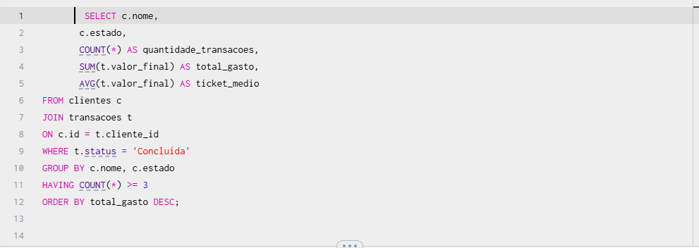
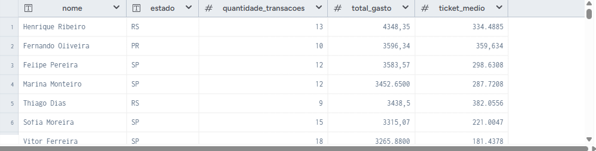
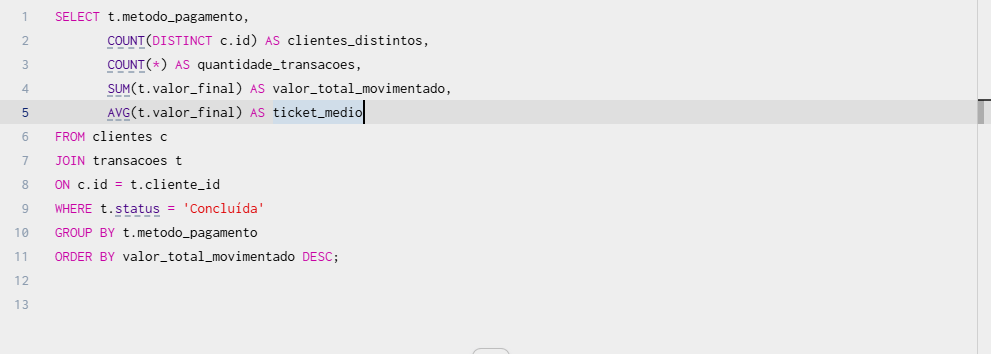
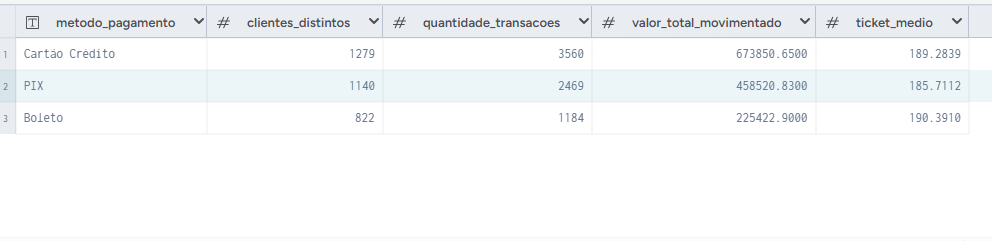

# Análise Financeira de Clientes com SQL

## 📊 Sobre o projeto
Projeto desenvolvido com foco em análise de dados utilizando SQL.

O objetivo da análise é identificar padrões financeiros, comportamento de clientes e métricas relevantes para apoio na tomada de decisão.

---

## 🧠 Problemas analisados

- Quais clientes possuem maior volume financeiro
- Métodos de pagamento mais utilizados
- Ticket médio por cliente
- Volume financeiro movimentado
- Quantidade de transações concluídas

---

## 🛠️ Técnicas SQL utilizadas

- JOIN
- GROUP BY
- HAVING
- COUNT
- COUNT(DISTINCT)
- SUM
- AVG
- MAX
- MIN
- ORDER BY

---

## 📈 Objetivo da análise

A análise busca gerar insights financeiros e identificar padrões de comportamento de clientes para apoio estratégico.

---

## 📂 Estrutura do projeto

- README.md
- analise_clientes.sql
- analise_pagamentos.sql

---

## 📸 Exemplos das análises

### 🔹 Análise de Clientes

---

### 🔹 Análise de Pagamentos

